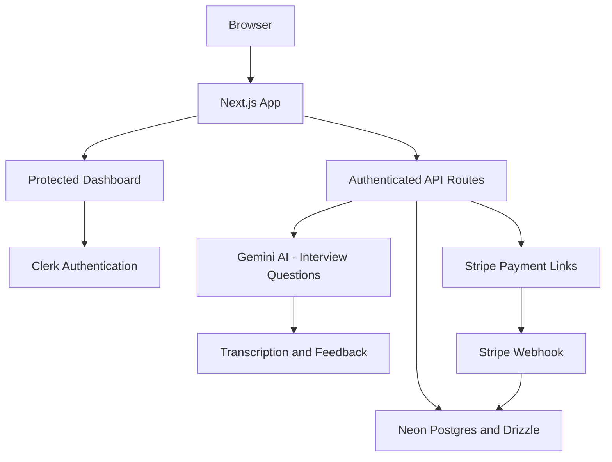

# SimulateRecruitAI

An AI-powered interview practice platform for generating role-specific questions, recording answers and reviewing structured feedback. It uses a responsive Next.js interface with server-protected AI, data and payment flows.

## Highlights

- Adaptive mock interviews: five baseline questions plus an optional 2-3-question follow-up round, capped at ten.
- Gemini-powered question generation, audio transcription, 1-10 scoring and actionable feedback.
- Saved interview history, custom practice sets and attempt-based feedback grouped in blocks of five.
- Clerk authentication, ownership checks, rate limits, input validation and prompt-injection guardrails.
- Stripe Monthly/Yearly Payment Links with signed webhooks and database-backed subscription records.
- Responsive light, dark, and system themes with a mobile-ready landing page and dashboard.

## Architecture



Browser code never imports the database client or Gemini key. Protected API routes validate the current Clerk user before reading or writing user-owned data. Stripe verifies completed checkout events through a signed webhook before subscriptions are stored.

## Tech Stack

| Area | Technology |
|---|---|
| App | Next.js 16, React 18 |
| UI | Tailwind CSS, Radix UI, next-themes |
| Auth | Clerk |
| Data | Neon Postgres, Drizzle ORM |
| AI | Gemini 3.5 Flash-Lite |
| Payments | Stripe Payment Links and webhooks |
| Deployment | Vercel or Docker |

## Project Structure

```text
app/
  api/          Server-only AI, data, billing, subscription and webhook routes
  dashboard/    Protected interview, practice, feedback and upgrade screens
  _components/  Landing-page components
components/     Shared UI primitives
utils/          Database, Gemini, prompt, auth, rate-limit and schema utilities
proxy.js        Clerk session integration
```

## Security Notes

- Keep `NEXT_DRIZZLE_DB_URL`, `NEXT_GEMINI_API_KEY`, `NEXT_PROMPT` and Stripe secrets server-only.
- Only `NEXT_PUBLIC_CLERK_PUBLISHABLE_KEY` and intentional client UI settings use `NEXT_PUBLIC_`.
- Configure Stripe events for `checkout.session.completed` and `checkout.session.async_payment_succeeded` at `/api/stripe/webhook`.

---

## Local Development

**1. Clone & Install**
```bash
git clone https://github.com/Soumilgit/Soumilgit-AI-Interview-SAAS.git
cd Soumilgit-AI-Interview-SAAS
npm install
```

**2. Configure Environment Variables**
Create a `.env.local` file:
```bash
NEXT_PUBLIC_CLERK_PUBLISHABLE_KEY=
NEXT_PUBLIC_INTERVIEW_QUESTION_COUNT=10
CLERK_SECRET_KEY=
NEXT_DRIZZLE_DB_URL=
NEXT_GEMINI_API_KEY=
NEXT_PROMPT="You are a professional interview coach..."
NEXT_STRIPE_MONTHLY_PAYMENT_LINK=
NEXT_STRIPE_YEARLY_PAYMENT_LINK=
NEXT_STRIPE_WEBHOOK_SECRET=
```

**3. Run Locally**
Configure Clerk plus the server-only database and AI variables locally, then
```bash
npm run dev
```

or with Docker:
```bash
docker compose up --build
```

---

## Production Deployment
Use platforms like **Vercel**, **Render**, **Railway** or **Docker-based VPS** .

Add the variables to your hosting provider. Only `NEXT_PUBLIC_CLERK_PUBLISHABLE_KEY` is public; never expose the database URL or Gemini API key.

---

## How To Contribute

1. Fork this repo & clone your fork locally.  
2. Create a new branch: `git checkout -b your-feature-name`  
3. Make changes, test locally, then commit: `git commit -m "your message"`  
4. Push to your fork: `git push origin your-feature-name`  
5. Open a Pull Request - I’ll take it from there.  
